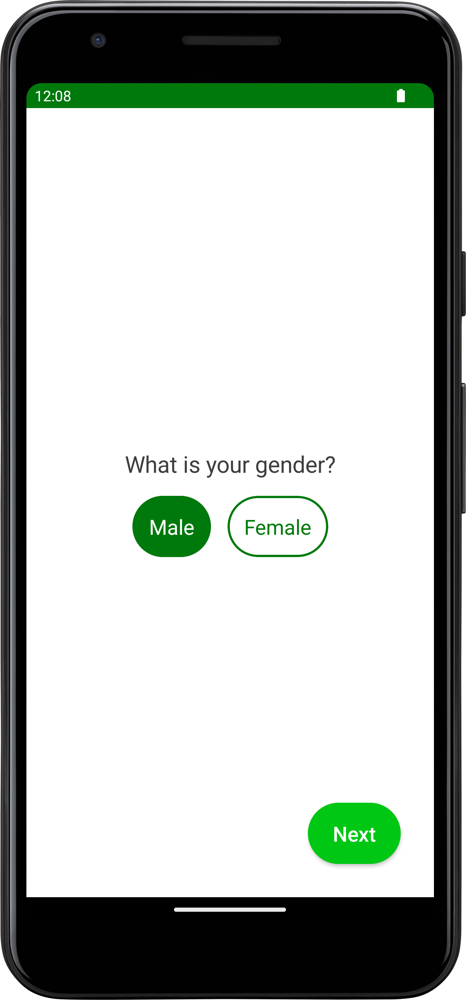
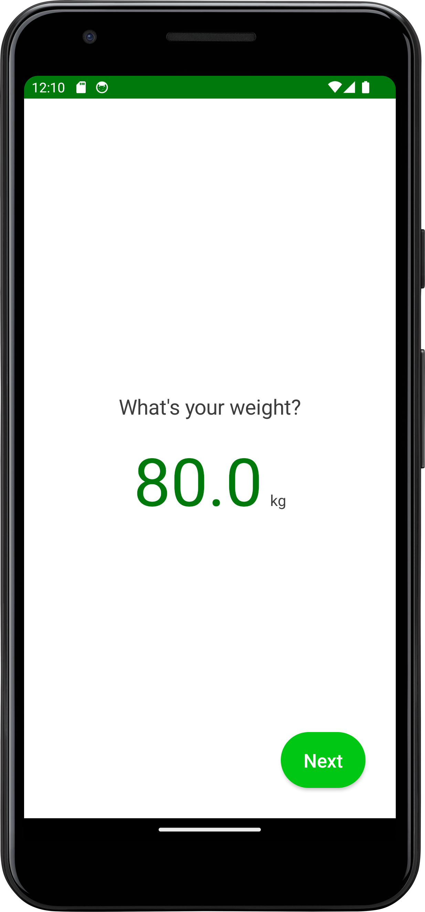
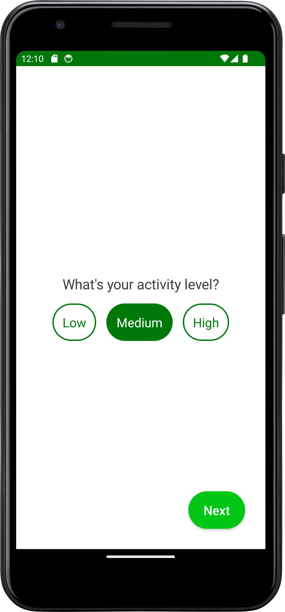
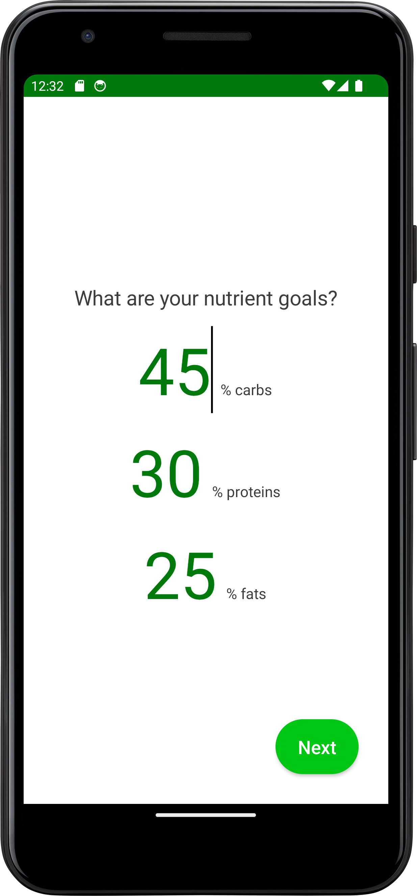
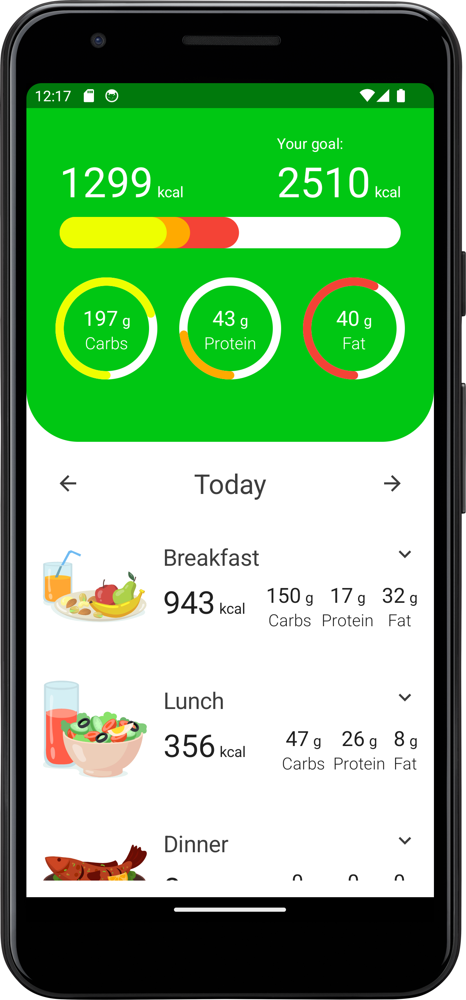
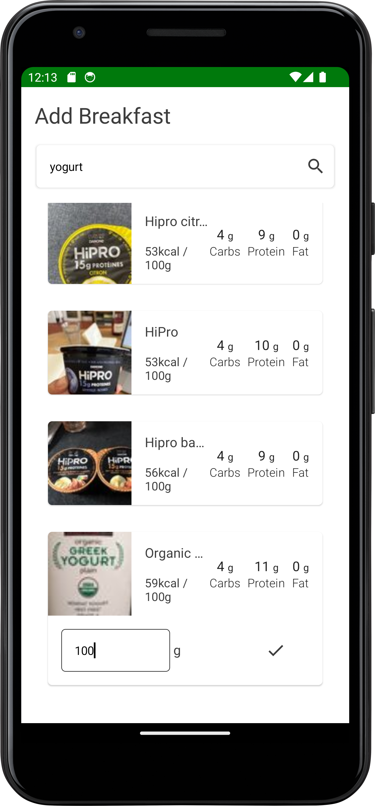

# CalorieTracker

CalorieTracker is an Android application built using Kotlin and Jetpack Compose. The project demonstrates a modular approach to Android application development, leveraging Multi-Module and Clean Architecture principles to ensure scalability, maintainability, and testability.

## Table of Contents

- [Features](#features)
- [Technologies Used](#technologies-used)
- [Architecture](#architecture)
- [Screenshots](#screenshots)

## Features

- Track daily calorie intake
- Add and manage food items
- View historical data and trends
- User-friendly interface with modern UI components

## Technologies Used

- **Kotlin**: Programming language for Android development
- **Jetpack Compose**: Modern toolkit for building native Android UI
- **Multi-Module Architecture**: Separation of code into distinct modules for better manageability
- **Clean Architecture**: Layered architecture to separate concerns and improve testability
- **Hilt**: Dependency injection framework for Android
- **Room**: Persistence library for local database management
- **Coroutines**: For asynchronous programming
- **Flow**: For reactive programming and data streams
- **Retrofit**: HTTP client for API calls
- **Coil**: Image loading library for Android

## Architecture

The project follows Clean Architecture principles, organized into multiple layers:

1. **Presentation Layer**: Contains UI components and ViewModels.
2. **Domain Layer**: Contains use cases and business logic.
3. **Data Layer**: Manages data sources including remote and local repositories.

The modular structure is as follows:

- `app`: Main application module.
- `core`: Shared utilities and base classes.
- `core_ui`: Shared UI components and resources.
- `onboarding`: Feature module for the onboarding process.
- `tracker`: Feature module for tracking calorie intake and related functionalities.

## Screenshots

Choose your gender                                        |  Set your weight                                       |  Set your activty level
:--------------------------------------------------------:|:------------------------------------------------------:|:------------------------------------------------------:
              |            |  

Set your daily nutrient goals                             |  Home page                                             |  Search and add food
:--------------------------------------------------------:|:------------------------------------------------------:|:------------------------------------------------------:
      |              |  

